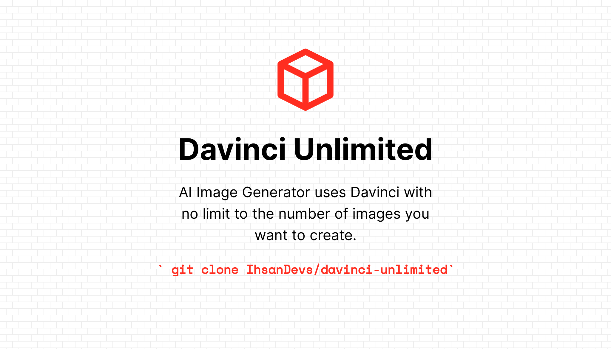

# Davinci Unlimited



Davinci Unlimited adalah generator gambar AI yang menggunakan Davinci tanpa batasan jumlah gambar yang ingin Anda buat. Proyek ini memungkinkan pengguna untuk menghasilkan gambar baru berdasarkan prompt dan gaya yang diberikan, mendapatkan inspirasi, dan gaya dari API, serta menghasilkan akun baru.

## Fitur

- **Generasi Gambar Baru**: Menghasilkan gambar baru berdasarkan prompt dan gaya yang diberikan.
- **Pengambilan Inspirasi**: Mendapatkan judul inspirasi dari API.
- **Pengambilan Gaya**: Mengambil gaya dari API.
- **Pembuatan Akun Baru**: Menghasilkan akun baru dengan token akses, token refresh, dan id token.

## Instalasi

Untuk menggunakan Davinci Unlimited, clone repositori ini dan instal dependensi yang diperlukan.

1. Clone Repositori

```bash
git clone https://github.com/IhsanDevs/davinci-unlimited.git
```

2. Masuk ke folder project

```bash
cd davinci-unlimited
```

3. Install Dependensi

```bash
npm install
```

## Penggunaan

Setelah instalasi, Anda dapat menjalankan aplikasi dengan perintah berikut:

```bash
npm start
```

### Contoh Penggunaan Fungsi

```javascript
import Helpers from "./Helpers/index.js";

// Untuk mendapatkan inspirasi
const inspiration = await Helpers.getInspiration(bearerToken);

// Untuk mendapatkan gaya
const styles = await Helpers.getStyles(bearerToken);

// Untuk menghasilkan akun baru
const account = await Helpers.generateNewAccount();

// Untuk menghasilkan gambar baru
const image = await Helpers.generateNewImage(
  bearerToken,
  prompt,
  aspect,
  style,
  substyles,
  seed,
  step,
  customImageToPath
);
```

Pastikan untuk mengganti parameter yang diperlukan sesuai dengan kebutuhan.

## Kontribusi

Kontribusi dipersilakan! Silakan buat issue atau pull request untuk berkontribusi pada proyek ini.

## Lisensi

Proyek ini dilisensikan di bawah ISC License.
